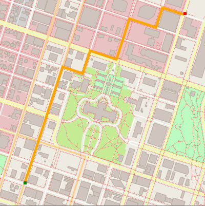
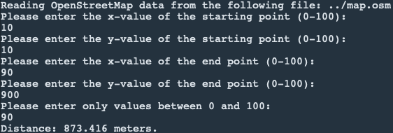

# Project 1 - Route Planning Project

This is the first project from [Udacity's C++ Nanodegree Program](https://www.udacity.com/course/c-plus-plus-nanodegree--nd213). It covers the fundamentals of the coding language C++ and the A* search algorithm using real map data from the [OpenStreetMap](https://www.openstreetmap.org/) project.

----

## Project Overview

### Goals:

* Implement the A* algorithm to find the shortest path between to given points.
* Allow the user to input start and goal coordinates

### Structure:

The project is divided into different files.

* `src/main.cpp`: the i/o code and call of the planning and rendering algorithms
* `src/model.cpp` (and header file): data structures and functions for OpenStreetMap functionality
* `src/render.cpp` (and header file): functions for displaying results
* `src/route_model.cpp` (and header file): modification of the basic model data structure
* `src/route_planner.cpp` (and header file): implementation of the A* algorithm
* other helper, build and installation files

### Dependencies

This project needs following dependencies:

* cmake >= 3.11.3
* make >= 4.1 (Linux, Mac), 3.81 (Windows)
* gcc/g++ >= 7.4.0
* IO2D
  * Installation instructions for all operating systems can be found [here](https://github.com/cpp-io2d/P0267_RefImpl/blob/master/BUILDING.md)
  * This library must be built in a place where CMake `find_package` will be able to find it

### Basic Build and Run Instructions

1. Clone this repository.
2. Create a build directory: `mkdir build && cd build`
3. Compile: `cmake .. && make`
4. Run it: `./OSM_A_star_search` or to specify a map file: `./OSM_A_star_search -f ../<your_osm_file.osm>`.

----

# Results

Here you can see an example result (values: X(10,10) and Y(90,90)):

